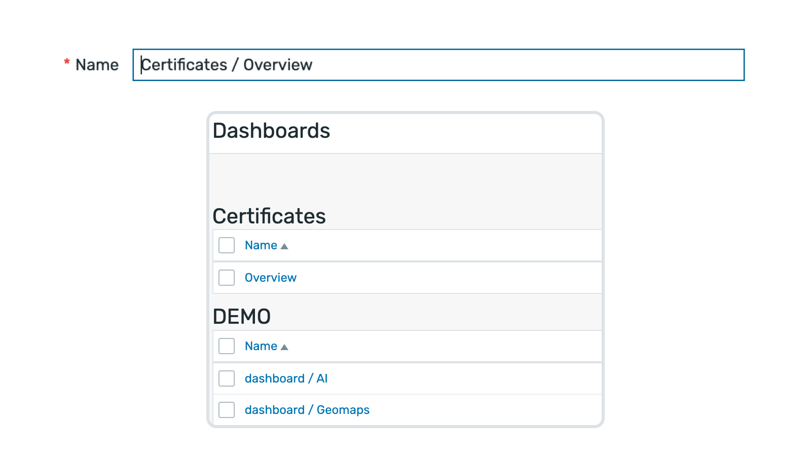

    
    <h3>
        
            Honesty, diligence and MAXimum knowledge of our products is our standard.
        
    </h3>
    <h3>
        &nbsp;&nbsp;&nbsp;
        &nbsp;&nbsp;&nbsp;
        &nbsp;&nbsp;&nbsp;
        &nbsp;&nbsp;&nbsp;
        &nbsp;&nbsp;&nbsp;
        
    </h3>

 

---
---

 
 

    <h1>
        Structured Dashboards
    </h1>
    <h4><i>
        Organize your dashboards with automatic hierarchical grouping
    </i></h4>
     
    
    
     
    

 
 

## Description
The Structured Dashboards module automatically organizes your Zabbix dashboards into logical groups based on their naming convention. By using a simple slash (`/`) separator in dashboard names, you can create a hierarchical structure that makes navigation more intuitive and efficient.

## Key Features

### Automatic Grouping
- **Slash-Based Hierarchy**: Use `Category / Dashboard Name` format
- **First-Level Grouping**: Groups dashboards by content before the first `/`
- **Collapsible Sections**: Each group can be expanded or collapsed

### Naming Examples
- `DEMO / AI` → Groups under "DEMO"
- `DEMO / Geomaps` → Groups under "DEMO"  
- `Certificates / Overview` → Groups under "Certificates"

### Use Cases
- **Project Organization**: `ProjectA / Overview`, `ProjectA / Details`
- **Department Structure**: `IT / Infrastructure`, `Sales / Metrics`
- **Service Categories**: `Database / MySQL`, `Database / PostgreSQL`
- **Environment Separation**: `Production / App`, `Development / App`

### Limitations
- Currently supports only first-level grouping (first `/` only)
- Additional `/` characters are treated as part of the dashboard name

 
 

  

    <a href="https://www.initmax.com/wiki/structured-dashboards">
         
        <b>Documentation</b> 
        
    </a>

 
 

---
---

 

    <a href="https://www.initmax.com/">
         initMAX.com
    </a>&nbsp;&nbsp;&nbsp;
    <a href="tel:+420800244442">
         +420800244442
    </a>&nbsp;&nbsp;&nbsp;
    <a href="mailto:info@initmax.com">
         info@initmax.com
    </a>
       
    &nbsp;
    &nbsp;
    &nbsp;
    &nbsp;
    &nbsp;
       
    &nbsp;&nbsp;&nbsp;
    
       
    

