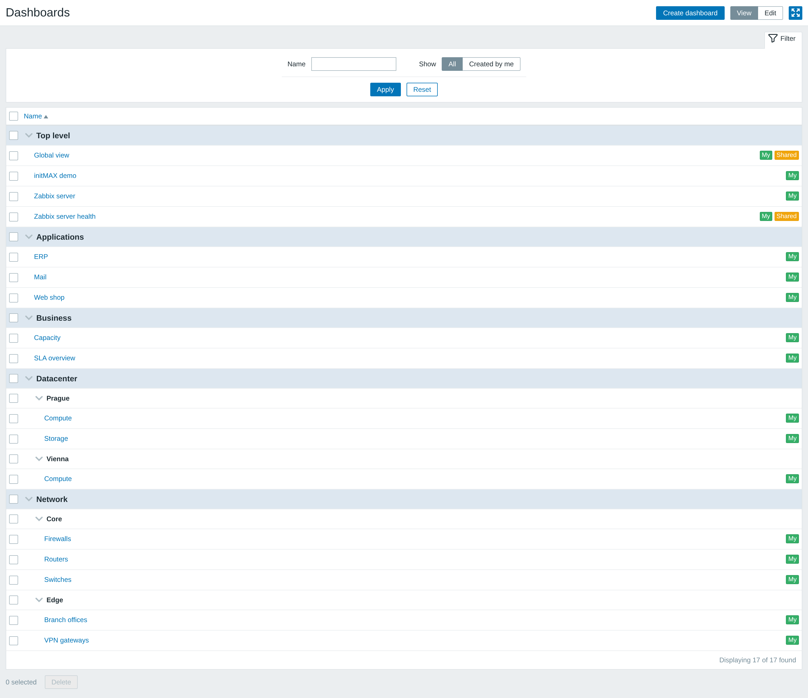
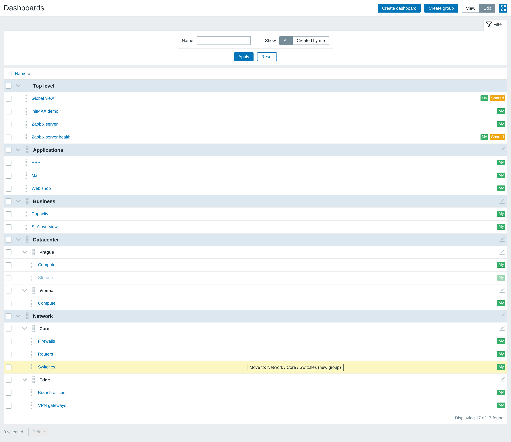
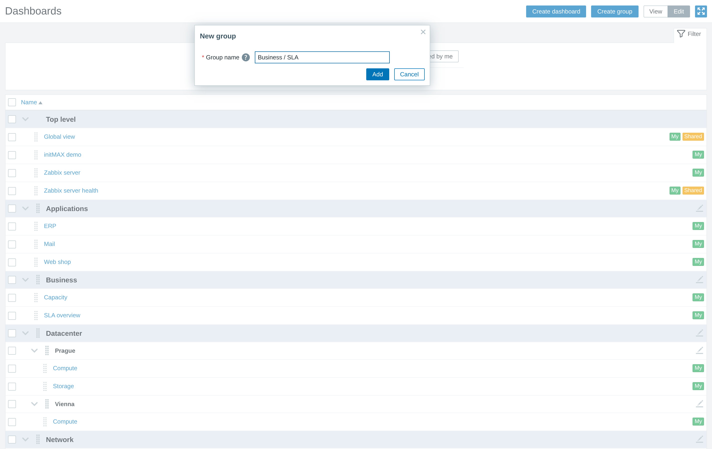
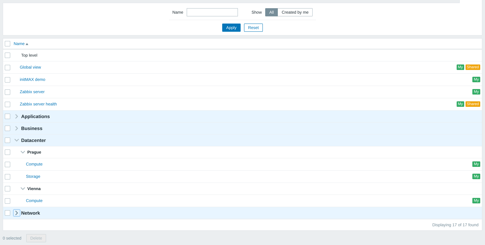
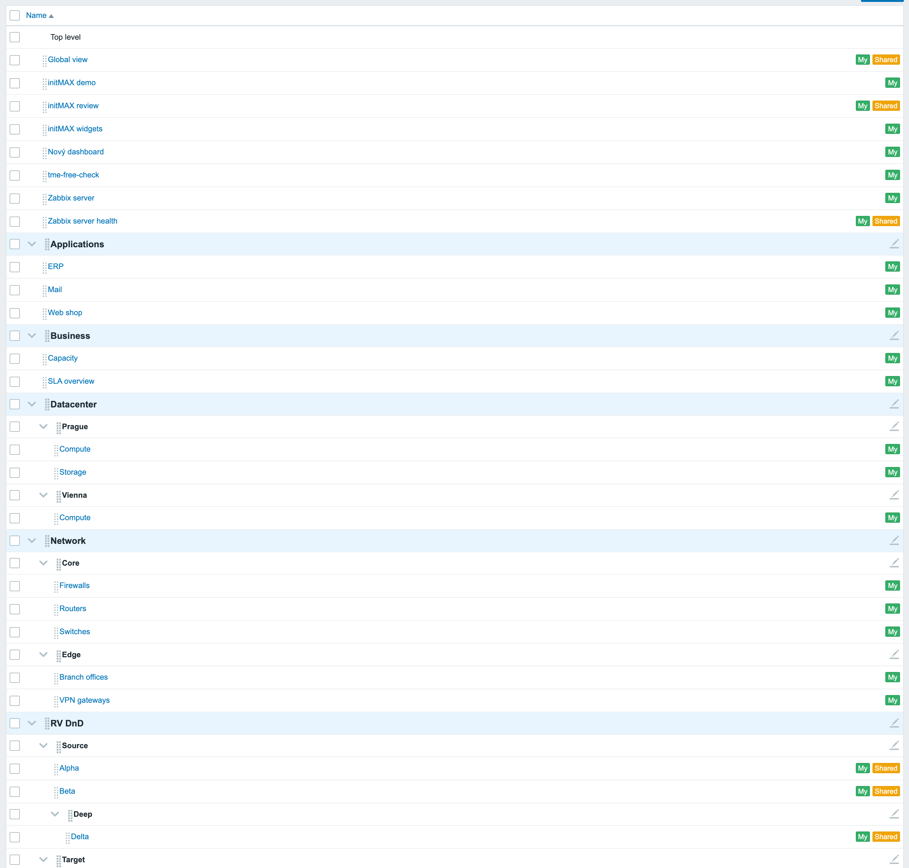
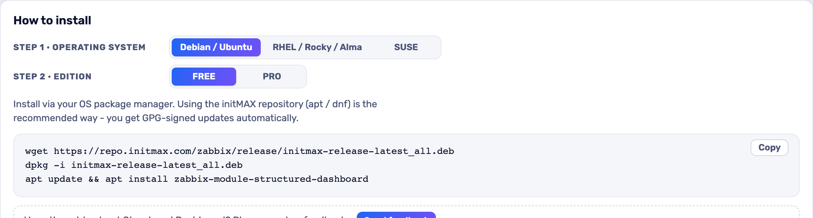

<h1>Structured Dashboard</h1>

developed and maintained by

and community

<strong>Turns a flat wall of dashboards into a list you can actually navigate.</strong> 
Turns "Network / Core / Datacenter A" into a folder tree on the Dashboards page - nested sections you can fold, so an installation with a hundred boards stops being a scroll.

<a href="#what-you-can-build"><strong>Features</strong></a> &nbsp;·&nbsp;
<a href="#examples"><strong>Examples</strong></a> &nbsp;·&nbsp;
<a href="#install"><strong>Install</strong></a> &nbsp;·&nbsp;
<a href="#free-vs-pro"><strong>FREE vs PRO</strong></a> &nbsp;·&nbsp;
<a href="https://portal.initmax.com"><strong>Portal</strong></a> &nbsp;·&nbsp;
<a href="https://www.initmax.com/wiki/structured-dashboards/"><strong>Docs</strong></a>

 

---

## Why Structured Dashboard

Zabbix lists every dashboard you can see in one flat, alphabetical table. That is fine with ten of them and unusable with a hundred, where finding the one board you need means scrolling past everyone else's.

**Structured Dashboard** reads the `/` you already put in dashboard names and turns it into structure. `Network / Core / Datacenter A` becomes **Datacenter A** inside **Core** inside **Network**, nested as deep as you name it, and every level folds away. What you folded is remembered per user, so the page opens the way you left it. There is nothing to configure: rename a dashboard and it moves - or skip the renaming and drag it, because dropping a dashboard (or a whole group) anywhere in another group's block renames it for you - slide the pointer left into the indent gutter to land a level higher, the highlighted block and the "Move to" line tell you where - **Create group** next to **Create dashboard** gives you an empty group to drop things into, and the pencil on a group row renames the group with everything in it. All of that lives behind a **View | Edit** switch like the one on Zabbix's Services list: View is the plain tree, Edit shows the handles and controls, and your choice is remembered. It is still one compact Zabbix list - the same rows, the same filter, the same actions, the Name header sorting every level - plus one tick-box per group to select everything under it.

## What you can build

<table>
<tr>
<td width="50%" valign="top">

**Nested dashboard groups**

The / in dashboard names becomes structure: Network / Core / Datacenter A nests three levels deep.

</td>
<td width="50%" valign="top">

**Fold what you do not need**

Every level collapses, and what you folded is remembered per user. Dashboards outside any group live under **Top level**, which behaves as a full category of its own - bold, tinted and collapsible like the rest.

</td>
</tr>
<tr>
<td width="50%" valign="top">

**Drag & drop between groups**

Drag a dashboard, or a whole group, anywhere into another group's block and it is renamed into it - a group dropped on another becomes its subgroup, at any depth, and a dashboard dropped on a dashboard opens a new group named after it, next to it; anywhere over a row means into that row's group, the indent gutter to its left walks up the levels, collapsed groups open while you hover. No typing, and the same permissions Zabbix applies to editing.

</td>
<td width="50%" valign="top">

**Create a group first, fill it later**

Create group opens an empty group; drop dashboards into it and it becomes a real group. Rename any group in place with the pencil on its row; empty ones can be removed again.

</td>
</tr>
<tr>
<td width="50%" valign="top">

**Nothing to configure**

Rename a dashboard and it moves; there is no admin page and nothing to maintain.

</td>
<td width="50%" valign="top">

**The stock page, structured**

One compact list, same rows, same filter, same actions, the frontend's own fold control, the Name header sorting every level - plus one tick-box per group to select everything under it.

</td>
</tr>
</table>

## Examples

<table>
<tr>
<td width="50%" align="center" valign="top"> <small><b>Drag &amp; drop</b> - Drag a dashboard over another row; the highlighted target and the Move to hint tell you where it lands - here Storage dropped on Switches opens a new group named after it.</small></td>
<td width="50%" align="center" valign="top"> <small><b>Create group</b> - An empty group by path (Business / SLA nests), ready to be filled by drag &amp; drop.</small></td>
</tr>
<tr>
<td width="50%" align="center" valign="top"> <small><b>Collapsed</b> - Collapse sections you do not need and expand only the branch that contains the dashboard you are looking for.</small></td>
<td width="50%" align="center" valign="top"> <small><b>Edit mode</b> - Drag handles on every row, a pencil on every group to rename it in place, and the View | Edit switch remembered per user.</small></td>
</tr>
</table>

## Configuration

There is nothing to configure - install it, enable it, done.

## Install

**FREE** ships as **GPG-signed `deb` / `rpm` packages** from the initMAX repository - `apt` / `dnf` installs them and keeps them updated.

### Easiest way - the guided installer on the Portal

Open the product page, pick your **OS** and **edition**, and copy the ready-made command. FREE is fully public (no login); PRO fills in your token once you sign in. There's a feedback box right there too.

<a href="https://portal.initmax.com/catalog/zabbix-structured-dashboard#how-to-install"><strong>→ Open the installer on the Portal</strong></a>

Prefer a plain archive? Every release also ships as a **ZIP** [straight from the repo](https://repo.initmax.com/zabbix/free/zip/structured-dashboard/) - handy for offline or manual installs.

The module is enabled automatically during the package installation - verify it in **Administration → General → Modules**. Done.

## FREE vs PRO

There is no paid edition - everything below is in the one package.

| Feature | FREE |
| ---------------------------------------------------------- | :----: |
| Nested dashboard groups from the / in dashboard names | ✅ |
| Every level folds away, the state is remembered per user | ✅ |
| Drag & drop dashboards and whole groups between groups | ✅ |
| Create group - an empty group that fills up by drag & drop | ✅ |
| Rename a group in place - every dashboard in it follows | ✅ |
| View / Edit switch as on the Services list, remembered per user | ✅ |
| Name header sorts groups and dashboards at every level | ✅ |
| Nothing to configure - rename a dashboard and it moves | ✅ |
| Same rows, filter and actions as the stock page | ✅ |
| Localised into all 25 Zabbix display languages | ✅ |
| High availability ready | ✅ |
| Licence | AGPLv3 |

## Requirements

|              |                                                              |
| ------------ | ------------------------------------------------------------ |
| **Zabbix**   | 6.0 · 6.2 · 6.4 · 7.0 · 7.2 · 7.4 - one package covers all    |
| **PHP**      | 7.4 or newer                                                 |
| **OS**       | Debian/Ubuntu · RHEL/Rocky/Alma/Oracle/Amazon · SUSE         |
| **Editions** | FREE (public repo) - there is no paid edition                  |
| **Languages** | All 25 Zabbix display languages - the module follows each user's own language setting |
| **High availability** | Ready. Which groups you collapsed, and the empty groups you created, are stored in your Zabbix user profile - in the database, not on the frontend node - so install it on every node of an HA cluster and any node can serve the page with your layout intact |

**Every version behaves the same.** The same nesting, the same collapse control, the same drag & drop, the same per-group selection, on 6.0 as on 7.4. The fold control is whatever the frontend itself uses for expandable rows - the chevron icon button on 7.x, the arrow of the 6.x line - so it never looks foreign. There is exactly one difference, and it is Zabbix's, not ours: 6.0 has no documentation ("?") link on the Dashboards page, so the module does not draw one there either. Nothing else is left out on any version - a control that would be drawn but dead is not shipped at all.

Under the hood the package carries two module trees, because Zabbix 6.0/6.2 load one manifest format and 6.4 and newer load another. They are the same product: the page and its client are written once and both trees use them, which a build-time check enforces.

## Support &amp; links

- **[Documentation / Wiki](https://www.initmax.com/wiki/structured-dashboards/)**
- **[Product page](https://www.initmax.com/product/structured-dashboards/)**
- **[Portal](https://portal.initmax.com)** - downloads, tokens, support tickets
- **Source code (FREE, AGPLv3)** - included in every package and published as a [source archive](https://repo.initmax.com/zabbix/free/zip/structured-dashboard/) on repo.initmax.com
- **[support@initmax.com](mailto:support@initmax.com)**

---

FREE: <a href="https://www.gnu.org/licenses/agpl-3.0.html">AGPLv3</a> &nbsp;·&nbsp; © 2021-2026 initMAX s.r.o.

